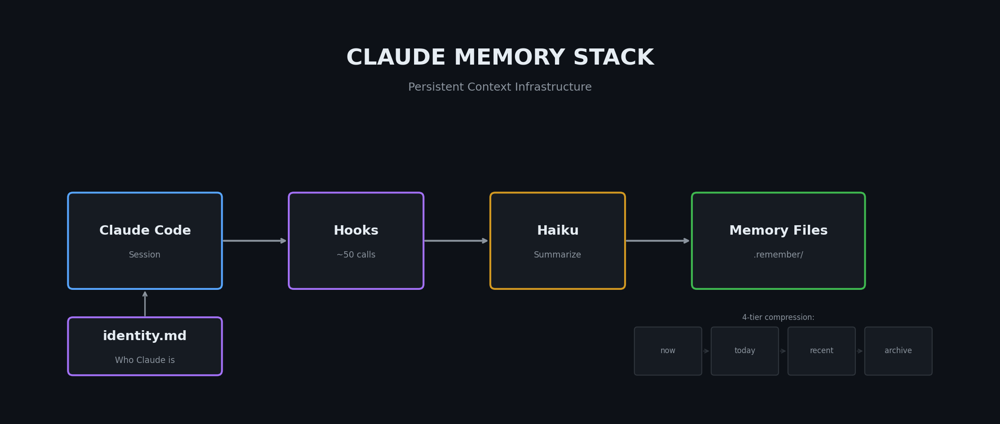

# Claude Memory Stack



**Portable memory infrastructure for Claude Code — persistent context across sessions.**

Claude Code is stateless by default. Every session starts fresh. After months of daily use, I was re-explaining the same context over and over:

- "No, we already tested that signal — it failed."
- "No, use this API key pattern."
- "No, the user prefers terse responses."

This repo contains the infrastructure I built to give Claude persistent memory that survives context window compaction.

---

## What's Included

### 1. Remember Pipeline (`.claude/remember/`)
Hook-based system that automatically extracts and compresses session learnings:
- Hooks fire after every ~50 tool calls
- Haiku summarizes what happened in 1-3 sentences
- 4-tier compression: `now.md` → `today-*.md` → `recent.md` → `archive.md`
- Zero manual work — runs in the background

### 2. Identity File
Tells Claude who it is for this specific project:
- Role and responsibilities
- Values and working style
- Key reference files
- Project-specific context

### 3. Obsidian Integration (Optional)
Same repo viewed as a navigable knowledge graph:
- Wiki-links auto-generated
- MOC (Map of Content) files for navigation
- Rejected Ideas tracker prevents re-investigating dead ends

---

## Efficiency Gains

| Before | After |
|--------|-------|
| 10-15 min context rebuild per session | Auto-save on ~50 tool calls (zero manual work) |
| Re-investigating killed ideas | MOC - Rejected Ideas prevents re-work |
| Forgetting user preferences | Identity injection = Claude knows the project cold |

**Time saved:** 45-60 min/day across 5-7 hrs of sessions

---

## Quick Start

1. **Download** the [`.claude/remember/`](.claude/remember/) directory from this repo
2. Copy it to your project root
3. Edit `identity.md` for your project's context
4. Add hooks to `.claude/settings.local.json`:

```json
{
  "hooks": {
    "SessionStart": [{
      "matcher": "",
      "hooks": [{
        "type": "command",
        "command": "bash .claude/remember/scripts/session-start-hook.sh"
      }]
    }],
    "PostToolUse": [{
      "matcher": "",
      "hooks": [{
        "type": "command",
        "command": "bash .claude/remember/scripts/post-tool-hook.sh"
      }]
    }]
  }
}
```

5. That's it — memory starts accumulating automatically

---

## Full Documentation

See **[IMPLEMENTATION.md](IMPLEMENTATION.md)** for:
- Complete directory structure
- All scripts and prompts
- Config reference
- Memory file schema
- Obsidian setup (plugins, graph settings, CSS)
- Windows compatibility notes
- Bootstrapping checklist

---

## Requirements

- Python 3.x
- `claude` CLI on PATH (for Haiku summarization calls)
- `ANTHROPIC_API_KEY` in environment
- Optional: `jq` (falls back to Python if missing)

---

## Memory Types

```markdown
---
name: user prefers terse responses
type: feedback
description: no trailing summaries after code changes
---

Skip the preamble. Lead with the answer.
```

| Type | What to Store |
|------|--------------|
| `user` | Role, preferences, expertise level |
| `feedback` | Corrections to Claude's behavior |
| `project` | Ongoing work, deadlines, goals |
| `reference` | Where to find external info |

---

## License

MIT — use it however you want.

---

Built by [@melontrades](https://github.com/melontrades) after 6 months of daily Claude Code usage.
